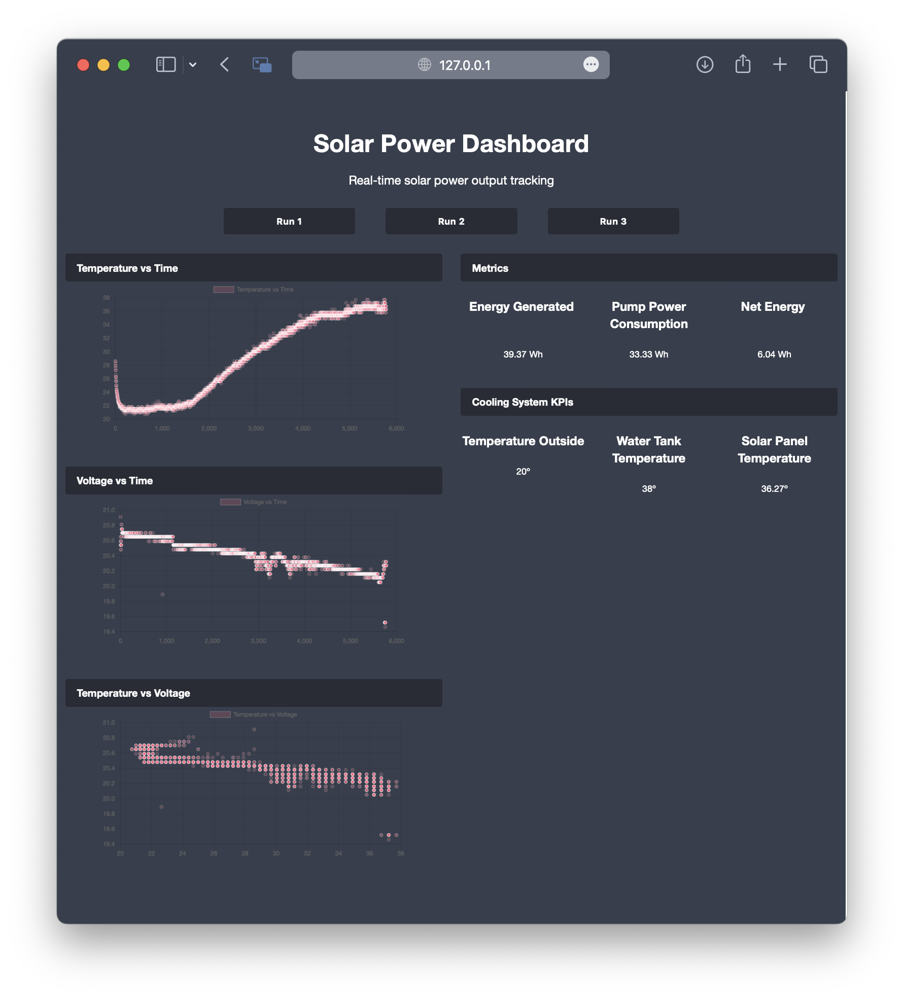

# Efficient-Solar-Panels-for-Hot-Water

## Project Abstract
Solar Panels average between 20% - 30% efficiency which decreases when temperatures get too high. Although it may be the sunniest day out, this drop in efficiency means hot sunny days produce less energy than cooler less sunny days. By adding a cooling process with water to existing solar panels, we can increase efficiency and extend the cell’s life. We can also use the waste heat from the solar panel to begin heating water for residential use. This can then be used in conjunction with a solar water heater, which has an efficiency of approximately 80%. Our system would be built and implemented with residential household electrical and piping systems. A smart monitoring system will be designed in such a way that it would be flexible and sufficient for a majority of houses. This is a heavy build project; requiring a mixture of electrical and plumbing skill sets to achieve a successful renewable energy system. The nature of the project will require modifications and/or changes to current or future designs in homes. By collecting data at different temperatures using our prototype, we can quantitatively show the energy and cost savings that our product can provide for the user.

## Our Current Progress
So far, we've built a cooling system for the solar panel by welding copper tubing together in a horizontal form. We built a wooden frame to hold the solar panel along with the copper backing conveniently above the water tank. See images below:

Our Dashboard is built using flask and will be hosted on a Raspberry Pi. The dashboard will display the temperature of the water tank, the temperature of the solar panel, and the temperature of the copper tubing. The dashboard will also display the amount of energy saved by using our system. See image below:

