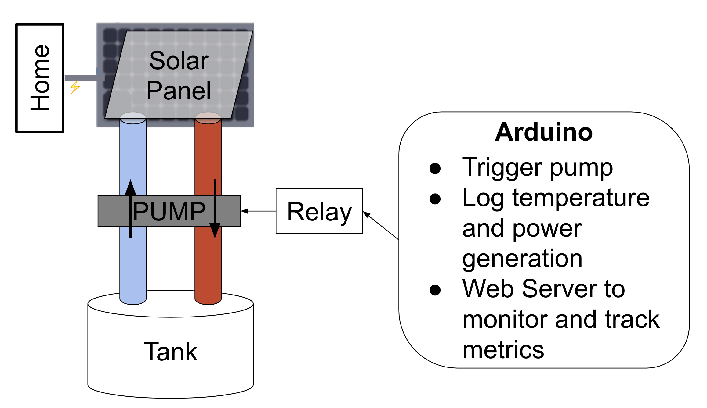

# Hardware Documentation

## Hardware Setup

Our solar panel system consists of the following components:
- 30W Solar Panel
- 12V Car Battery
- Voltage Divider Circuit
- Arduino UNO R3
- Thermistor (10kΩ)
- Copper Tubing
- 12V Water Pump (2 GPM)

### Solar Panel Specifications
- Wattage: 100 W
- Voltage at Maximum Power (Vmp): 18 V
- Current at Maximum Power (Imp): 1.67 A
- Open Circuit Voltage (Voc): 21.6 V
- Short Circuit Current (Isc): 1.75 A

### Water Pump Specifications
- Flow Rate: 3.33 GPM (gallons per minute)
- Power Consumption: 5-24W
- Maximum Temperature: 50ºC / 122ºF (completely submerged)
- Voltage: 12V DC
- Required Current: 1.5 A

### Voltage Divider Circuit
- Rbat2: 10 kΩ
- Rtherm2: 100 kΩ

### Thermistor Specifications
- Resistance at 25°C: 10 kΩ

